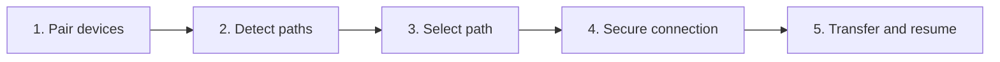
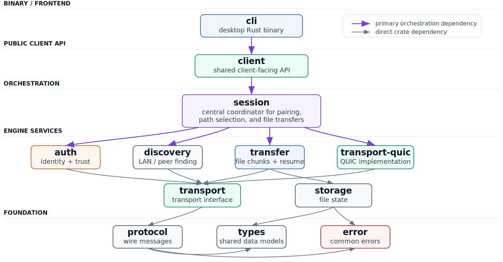
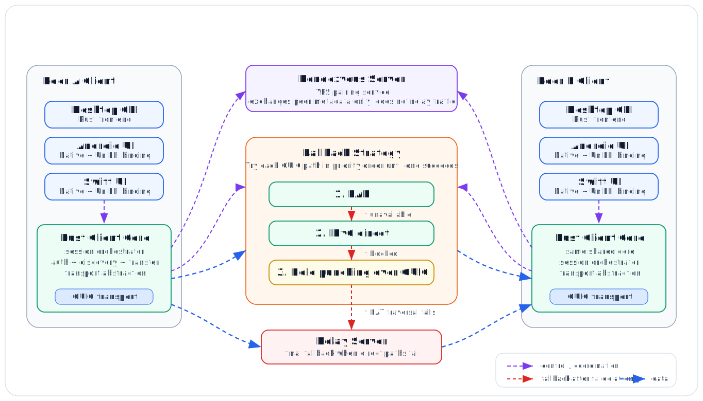

# envoix

Minimal CLI-first secure file transfer walking skeleton for VE441.

Envoix is a hybrid, adaptive platform for secure end-to-end file transfer. It
pairs devices without requiring an account, discovers available network paths,
and aims to select the fastest viable route across LAN, direct Internet,
peer-to-peer, and relay environments.

The project uses a shared Rust core so that the command-line client and future
mobile clients follow the same pairing, transfer, resume, and integrity rules.
The current skeleton product supports one-file transfer over QUIC, SPAKE2
shared-token authentication, QR invites, LAN discovery through mDNS, resumable
sequential chunks, and final BLAKE3 verification.

The planned connection strategy is:

1. LAN/direct QUIC;
2. public IPv6 direct QUIC;
3. QUIC UDP hole punching;
4. relay fallback;
5. encrypted store-and-forward, if required by the final product scope.

Rendezvous, public IPv6 exchange, hole punching, relay client integration,
mobile applications, and application-layer file encryption remain planned
work. The server and relay prototypes are developed on separate branches and
must be integrated with the current client before they are considered complete.

## Getting Started

### Current Scope

Implemented:

- LAN mDNS discovery — receiver advertises, sender browses `_envoix._udp.local.`;
- one-file transfer over a manually supplied address (or discovered via mDNS);
- QUIC transport;
- required experimental SPAKE2 shared-token pairing before file metadata;
- minimal length-prefixed JSON frame protocol;
- sequential resumable chunks with progress events;
- deterministic temp output file plus resume sidecar state;
- whole-file BLAKE3 verification before final rename;
- public CLI-facing facade through `envoix-client`.

Not implemented in this walking skeleton:

- end-to-end file encryption;
- relay or server fallback;
- interactive pause, folder transfer, or multi-file manifests;
- per-chunk hashes, parallel chunk transfer, or out-of-order chunk recovery;
- mobile camera scanning (QR invite requires manual paste on CLI).

QUIC currently uses generated self-signed certificates with an explicitly
insecure no-auth verifier. Peer/session authentication is provided by the
required pairing layer before transfer metadata is sent.

### Prerequisites

- Install the [Rust toolchain and Cargo](https://www.rust-lang.org/tools/install).
- Install [Git](https://git-scm.com/downloads) to clone the repository.
- A network that permits UDP is required for QUIC. LAN auto-discovery also
  requires multicast DNS traffic.

### Build and test

```bash
git clone https://github.com/ECE4410J-NUUB/envoix.git
cd envoix
git switch dev

cargo build --workspace
cargo test --workspace
cargo fmt --check
cargo clippy --all-targets --all-features -- -D warnings
```

The real-network mDNS test is ignored during a normal test run. Run ignored
network tests on a development machine with local networking enabled:

```bash
cargo test --workspace -- --ignored
```

### Usage

#### QR invite flow (recommended)

The receiver generates a random pairing token and prints a QR code plus an
invite string to the terminal. No manual token or address exchange is needed.

```bash
# Terminal 1 — receiver
cargo run -p envoix-cli -- receive --auto --output ./received
# prints QR code and: invite: envoix:<base64url>

# Terminal 2 — sender (paste the invite string printed above)
cargo run -p envoix-cli -- send --invite "envoix:<base64url>" ./hello.txt
```

The invite encodes the pairing token, receiver address, and a 5-minute expiry.
The sender validates the invite before attempting a connection.

#### LAN mDNS auto flow (same local network)

The sender discovers the receiver automatically via mDNS. No manual address
exchange or QR scanning — both sides just need the same shared token.

```bash
# Terminal 1 — receiver (advertises over mDNS with the given token)
cargo run -p envoix-cli -- receive --auto --output ./received --token "shared-token-123"

# Terminal 2 — sender (discovers the receiver over mDNS)
cargo run -p envoix-cli -- send --auto --token "shared-token-123" ./hello.txt
```

The receiver's QUIC listener binds to `0.0.0.0:0` and advertises its port over
mDNS. The sender browses for `_envoix._udp.local.` services, resolves discovered
records into QUIC candidates, and dials them in a deterministic order. SPAKE2
pairing still gates the transfer — a sender with the wrong token fails before
any file data is exchanged.

#### Manual flow

Supply the shared token and address explicitly. The receiver prints its
OS-assigned port after binding.

```bash
# Terminal 1 — receiver
cargo run -p envoix-cli -- receive --output ./received --token "shared-token-123"
# prints: listening on 0.0.0.0:<port>

# Terminal 2 — sender (use the receiver's reachable IP and printed port)
cargo run -p envoix-cli -- send --peer "192.168.1.5:<port>" --token "shared-token-123" ./hello.txt
```

Use `--ip-version ipv6` on `receive` to bind an IPv6 socket instead.

The receiver writes the file into the output directory using the original file
name. If a transfer is interrupted, restart both sides with the same source file
and output directory. The receiver resumes from its `.part` file and JSON sidecar
state, then verifies the whole-file BLAKE3 hash before the final rename.

See [docs/auth.md](docs/auth.md) for the pairing model and SPAKE2 prototype
security caveat.

## Model and Engine

### Story Map

The story map organizes the product around five user activities. The flow
below shows the user journey; the table defines the skeletal product, MVP, and
stretch scope in an editable format. A downloadable copy of the original
story-map and engine-architecture deck is available
[here](docs/assets/envoix-story-map-and-engine-architecture.pdf).



| Stage | Skeletal Product | MVP | Stretch Goals |
|-------|-----------------|-----|---------------|
| 1. Pair | One-scan pairing — no account, login, or contact list. Invites expire; tampered or malformed invites are refused. | Scan, link, or typed code | Multi-device invites |
| 2. Detect | Auto-discovery on LAN. Accept typed or scanned addresses. Clear error when no route available. | Checks every route (LAN, direct, relay, store-forward) | Network diagnostics |
| 3. Select | Fastest local path first, auto relay fallback. No manual setup. | Best path shown live | Works on locked-down networks |
| 4. Secure | Encrypted connection bound to paired devices. | End-to-end encryption (relays can't read contents) | Traffic obfuscation |
| 5. Transfer & Resume | Reliably send a file with clear progress. Interrupted transfers resume. Verified intact before save. | Android/desktop parity; continuous checks; survives network switch | Folders, multi-file, pause/resume, parallel delivery |

### Engine architecture



Applications depend on the public `envoix-client` facade. The client delegates
session setup to orchestration code, while authentication, discovery, transfer,
transport, protocol, and storage remain separate services. Lower-level crates
do not depend on the CLI, which allows future mobile bindings to reuse the same
engine.

| Component | Responsibility and implementation |
| --- | --- |
| `apps/envoix-cli` | Parses user commands, constructs client requests, prints QR invites, and renders lifecycle/progress events. |
| `envoix-client` | Public application-facing facade. It validates configuration and coordinates manual, QR, and LAN-auto workflows. |
| `envoix-session` | Wires concrete QUIC connections, pairing authentication, and the transfer engine. |
| `envoix-auth` | Runs SPAKE2 shared-token authentication and role-separated confirmation proofs bound to the QUIC channel. |
| `envoix-qr` | Encodes, decodes, validates, expires, and renders pairing invites. |
| `envoix-discovery` | Produces manual candidates and advertises/browses safe LAN records through mDNS. |
| `envoix-transport` | Defines transport-independent connection, dialer, and listener traits. |
| `envoix-transport-quic` | Implements the transport traits with Quinn QUIC streams. |
| `envoix-protocol` | Defines and encodes typed authentication and transfer frames with bounded frame sizes. |
| `envoix-transfer` | Implements sender/receiver state machines, sequential chunks, resume negotiation, progress events, and completion acknowledgement. |
| `envoix-storage` | Manages deterministic `.part` files, JSON sidecars, resume validation, and verified final rename. |
| `envoix-types` / `envoix-error` | Hold shared identifiers, protocol constants, roles, directions, and the common error model. |
| Rendezvous and relay prototypes | Register short-lived sessions, exchange candidates, allocate relay tokens, and forward opaque QUIC datagrams. Client integration is planned. |

### Data and control flow



Control flow starts when an application submits a send or receive request.
The client validates configuration and pairing material, gathers candidates,
selects a connection strategy, authenticates the resulting channel, and then
starts the transfer engine. Client and transfer event sinks report discovery,
authentication, progress, completion, and failure without coupling the engine
to a specific UI.

Data flow starts only after authentication. The sender transmits typed metadata
and sequential file chunks through `FrameConnection`. The receiver writes to a
deterministic temporary file and periodically persists resume state. It promotes
the temporary file to the final path only after the declared size and BLAKE3
hash have been verified.

Current automatic mode implements LAN mDNS discovery. IPv6 candidate exchange,
hole punching, and relay fallback shown in the diagram are planned stages of
the strategy engine.

## APIs and Controller

### Front-end to engine boundary

The CLI is a thin controller over `EnvoixClient`. Future desktop or mobile
front ends should call this same facade rather than importing protocol,
transport, or storage crates directly.

| Public API | Role |
| --- | --- |
| `ClientConfig::from_runtime_sources` | Loads the default chunk size, an optional TOML file, and environment overrides, then validates pairing configuration. |
| `EnvoixClient::send_file` | Sends one file to an explicitly supplied socket address. |
| `EnvoixClient::receive_file_with_bound_addr` | Binds a receiver, reports its concrete address, authenticates one peer, and receives one file. |
| `EnvoixClient::send` | Executes the automatic sender policy. It currently discovers LAN candidates through mDNS and tries them deterministically. |
| `EnvoixClient::receive` | Executes the automatic receiver policy. It binds QUIC, advertises over mDNS, accepts authenticated peers, and receives one file. |
| `SendFileRequest` / `ReceiveFileRequest` | Manual-mode input models containing paths, addresses, and resume behavior. |
| `SendRequest` / `ReceiveRequest` | Automatic-mode input models containing paths, policy, resume behavior, and listener address. |
| `ClientEventSink` | Reports connection-level events such as discovery start, candidate discovery, discovery failure, and authentication limits. |
| `EventSink` | Reports transfer-level hashing, start, progress, completion, and failure events. |

### Internal engine interfaces

| Interface | Contract |
| --- | --- |
| `DiscoveryProvider` | Returns typed connection candidates without performing transfer or authentication. |
| `TransportDialer` | Establishes a `FrameConnection` for a selected candidate. |
| `TransportListener` | Reports its bound address and accepts incoming `FrameConnection` objects. |
| `FrameConnection` | Sends and receives typed frames, optimized chunk payloads, channel-binding material, and close signals. |
| `TransferEngine` | Operates only on `FrameConnection`, storage paths, and event sinks; it does not know which concrete network strategy is in use. |

### Controller sequences

**Manual send:** parse CLI input -> build `SendFileRequest` -> dial QUIC -> run
SPAKE2 -> negotiate resume -> stream chunks -> verify completion.

**QR send:** decode and validate the invite -> extract token and candidate ->
reuse the manual send path.

**LAN auto send:** browse `_envoix._udp.local.` -> validate and deduplicate
candidates -> try candidates in deterministic order -> run SPAKE2 -> transfer.

**Auto receive:** bind a wildcard QUIC listener -> report the assigned port ->
publish a safe mDNS record -> accept and authenticate peers with bounded
parallel attempts -> stop advertising -> receive and verify the file.

### Planned rendezvous controller API

The initial server design uses capability-authenticated REST endpoints. These
routes are implemented in the server prototype but are not yet called by the
integrated client:

| Endpoint | Purpose |
| --- | --- |
| `POST /api/v1/sessions` | Receiver registers a short-lived session. |
| `POST /api/v1/sessions/{id}/join` | Sender joins with its capability. |
| `POST /api/v1/sessions/{id}/candidates` | Either peer publishes a typed QUIC candidate. |
| `GET /api/v1/sessions/{id}/candidates?since=N` | Polls incremental candidates from the other peer. |
| `DELETE /api/v1/sessions/{id}` | Receiver closes a session. |
| `GET /api/v1/health` | Provides unauthenticated liveness status. |
| `GET /api/v1/stats` | Provides authenticated operator statistics when enabled. |

The rendezvous server stores no file names, hashes, paths, or file bytes. Once
a path is established, peers still perform SPAKE2 authentication before any
transfer metadata is accepted.

### OS subsystem integration

- UDP sockets provide QUIC transport and route-based local address detection.
- Multicast DNS provides same-LAN service advertisement and discovery.
- The filesystem stores source files, deterministic partial files, and resume
  sidecars, with rename used only after integrity verification.
- Environment variables and TOML files provide runtime configuration.
- Terminal standard error carries human-facing logs, QR output, and progress so
  standard output remains available for future machine-readable output.

## Third-Party SDKs

Cargo installs the Rust libraries below automatically. This table lists only
dependencies that Envoix uses directly, not their transitive dependencies.

| Area | Direct dependency | Purpose |
| --- | --- | --- |
| CLI/front end | [Clap](https://docs.rs/clap/) | Command and argument parsing |
| CLI/front end | [qrcode](https://docs.rs/qrcode/) | Terminal QR matrix generation |
| CLI/front end | [tracing-subscriber](https://docs.rs/tracing-subscriber/) | CLI log formatting and filtering |
| Async runtime | [Tokio](https://tokio.rs/) | Async tasks, files, sockets, synchronization, and timers |
| Transport | [Quinn](https://docs.rs/quinn/) | QUIC endpoint, connection, and stream implementation |
| Transport security | [rustls](https://docs.rs/rustls/) and [rcgen](https://docs.rs/rcgen/) | TLS configuration and development certificates for QUIC |
| Pairing | [spake2](https://docs.rs/spake2/) | Experimental password-authenticated key exchange |
| Pairing | [hmac](https://docs.rs/hmac/) and [sha2](https://docs.rs/sha2/) | Pairing confirmation proofs |
| Discovery | [mdns-sd](https://docs.rs/mdns-sd/) | DNS-SD advertisement and LAN discovery |
| Integrity | [BLAKE3](https://docs.rs/blake3/) | Resume-prefix and whole-file hashing |
| Serialization | [Serde](https://serde.rs/), [serde_json](https://docs.rs/serde_json/), and [TOML](https://docs.rs/toml/) | Protocol metadata, resume state, invites, and configuration |
| Encoding | [base64](https://docs.rs/base64/) | URL-safe QR invite encoding |
| Core utilities | [async-trait](https://docs.rs/async-trait/), [getrandom](https://docs.rs/getrandom/), [num_enum](https://docs.rs/num_enum/), and [thiserror](https://docs.rs/thiserror/) | Async traits, secure randomness, wire enums, and typed errors |
| Observability | [tracing](https://docs.rs/tracing/) | Structured application and library diagnostics |
| Testing | [tempfile](https://docs.rs/tempfile/) | Isolated temporary files and directories in tests |

The server and relay prototypes directly use the following additional
dependencies. They are not yet part of the integrated client release:

| Back-end area | Direct dependency | Purpose |
| --- | --- | --- |
| HTTP server | [Axum](https://docs.rs/axum/) | Rendezvous REST API and server routing |
| HTTP middleware | [tower-http](https://docs.rs/tower-http/) | Request tracing and HTTP middleware |
| HTTP client | [reqwest](https://docs.rs/reqwest/) | Planned client-to-rendezvous communication |
| Credential protection | [ChaCha20Poly1305](https://docs.rs/chacha20poly1305/) | Sealing self-hosted relay credential bundles |
| Operator tooling | [humantime](https://docs.rs/humantime/) | Human-readable relay configuration durations |
| Back-end testing | [axum-test](https://docs.rs/axum-test/) | In-process rendezvous API integration tests |

The current front end is the Rust CLI. Android and Apple UI frameworks and the
Rust FFI technology have not been selected, so no mobile SDK is listed as a
committed dependency yet.

## View UI/UX

## Team Roster

- Sun Qizhen
- Zhang Jinbin
- Li Yuhao
- He Yumeng
